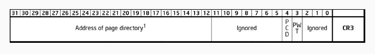
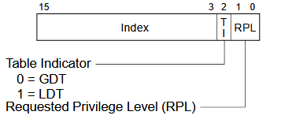
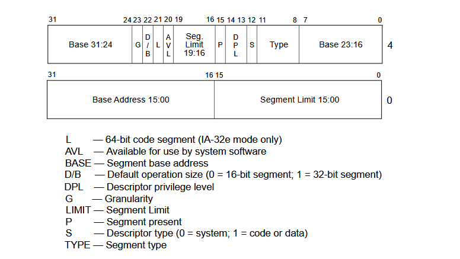
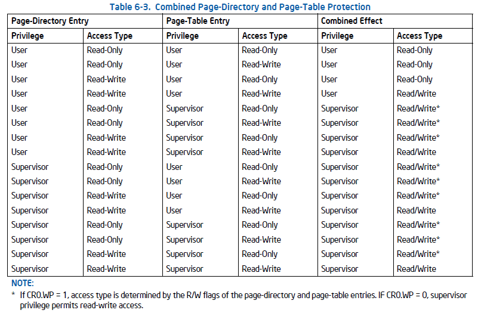

# Paginación y organización de la memoria

La **paginación** es un mecanismo que permite:
- Separar el espacio de direcciones virtual de las aplicaciones del espacio físico real
- Implementar *protección* entre procesos y entre el usuario y el sistema operativo
- Asignar memoria de forma flexible, permitiendo el uso de **memoria virtual**, swapping, etc

Organización del resumen:
- [Primer byte de memoria física](#mapa-del-primer-mb-de-memoria-física)
- [MMU](#unidad-de-manejo-de-memoria)
- [Esquema de paginación](#esquema-de-paginación)
- [Traducción de memoria virtual a física](#traducción)

Preguntas:
- *¿Qué pasa si los atributos U/S y R/W del directorio y de la página de tablas difieren?* [Respuesta](#qué-sucede-si-los-atributos-us-y-rw-del-directorio-y-de-la-página-de-tablas-difieren)
- *¿Qué es el buffer auxiliar de traducción (TLB)?* [Respuesta](#qué-es-el-buffer-auxiliar-de-traducción-tlb)

## Mapa del primer MB de memoria física

Observar que a partir de la dirección `0x1200` se encuentra ubicado el **kernel**, inmediatamente después se ubica el **código de la tarea Idle**. El resto del mapa muestra el **rango para la pila del kernel**, desde `0x24000` y a continuación la **tabla y directorio de páginas donde inicializar paginación para el kernel**. La parte derecha de la figura muestra la memoria a partir de la dirección `0xA000`, donde se encuentra mapeada la **memoria de video** y **código del BIOS**.

## Unidad de manejo de memoria
Ya viendo la memoria física en forma más general, vemos que se divide en: *kernel, área libre kernel y área libre tareas*.

El **área asociada al kernel** corresponde al **primer mega** de memoria, el **área libre kernel** a los **siguientes 3 MB** y el **área libre tareas** comienza en el **cuarto MB de memoria**

La administración de las áreas libres de memoria (área libre de kernel y área libre de tareas) se realizará a partir de una región de memoria específica para cada una. 

Podemos comprenderlas como un **arreglo predefinido de páginas** y **dos contadores de páginas**, uno para kernel y otro para usuario, que indican *cuál será la próxima página a emplear de cada región*.

Para **páginas de kernel** el arreglo va de `0x100000` a `0x3FFFFF` y para **páginas de usuario** de `0x400000` a `0x2FFFFFF`. Luego de cada pedido incrementamos el contador correspondiente. Para el contexto de la materia no implementamos un mecanismo que permita liberar las páginas pedidas. Vamos a referirnos al módilo que implementa este mecanismo como la **unidad de manejo de memoria (MMU)**. 

Las páginas del *área libre kernel* serán utilizadas para *datos del kernel* (directorios de páginas, tablas de páginas y pilas de nivel 0). Las páginas del área libre tareas serán utilizadas para datos de las tareas, stack de las mismas y memoria compartida bajo demanda. 


La **memoria virtual de cada una de las tareas** tiene mapeado inicialmente al *kernel* y el *área libre de kernel* con *identity mapping en nivel 0*. Además se mapearán las *páginas de código correspondientes*, la *página de memoria compartida* y una *página para la pila obtenida desde el área libre de tareas*.

A partir de la dirección virtual `0x07000000`se encontrará una página de memoria compartida de lectura escritura de nivel 3. Esta página será mapeada **on demand** cuando se intente hacer lectura/escritura en este espacio. La página física se encuentra en la dirección `0x3000000`

El **código de tareas** se encuentra a partir de la dirección virtual `0x08000000` y será mapeado como **sólo lectura de nivel 3** a la dirección física del código correspondiente. Cada tarea puede utilizar hasta 8KB de código. El **stack** será mapeado en la **página siguiente**, con **permisos de escritura y lectura**. La página física debe obtenerse del *área libre de tareas*. Finalmente, luego de la pila se mapeará la **página de memoria compartida** como **sólo lectura de nivel 3**. Esta página la usaremos más adelante para que las tareas puedan acceder fácilmente a info relevante del contexto de ejecución (teclas apretadas, tiempo desde el arranque del sistema, etc).

> En las funciones en donde se modifica el directorio o tabla de páginas, se debe llamar a la función tlbflush para que se invalide la cache de traducción de direcciones. 

# Esquema de paginación

- **CR3** -Dirección del directorio de páginas (32 bits): 20 bits identifican la página del directorio, el resto son atributos.

> Atributos:
> - PCD (Page Cache Disable): deshabilita cachear entradas del page directory.
> - PWT (Page Write-Through): deshabilita hacer write-back cuando el procesador modifica el page directory


- **Directorio de páginas** (4KiB/una página física): Array de 1024 entradas. Cada entrada traduce los 4MB que le corresponden.

> Atributos:
> - A (accessed): indica si se accedió a memoria controlada por esta PDE, lo escribe el procesador al traducir. 
> - PCD (Page Cache Disable): deshabilita cachear los datos de la page table asociada.
> - PWT (Page Write-Through): deshabilita hacer write-back al escribir en la page table asociada
> U/S (User/Supervisor): Determina si un proceso en modo usuario puede acceder a la memoria controlada por esta PDE
> R/W (Read/Write): Determina si un proceso puede escribir a la memoria controlada por esta PDE. 
> P (present): es el bit 0 (siempre en 1), indica que la traducción es válida.


- **Tablas de páginas** (cada una 4KiB/una página física): Array de 1024 entradas. Cada entrada traduce los 4KB que le corresponden (dentro del bloque de 4MB de su tabla)

>Atributos: 
> - G (global): marca la traducción como global. Las traducciones globales no se invalidan al cambiar el CR3.
> - D (dirty): indica si se escribió a memoria controlada por esta PTE, lo escribe el procesador al traducir.
> - A (accessed): indica si se accedió a memoria controlada por esta PTE, lo escribe el procesador al traducir. 
> - PCD (Page Cache Disable): deshabilita cachear los datos de la página asociada.
> - PWT (Page Write-Through): deshabilita hacer write-back al escribir en la página asociada
> U/S (User/Supervisor): Determina si un proceso en modo usuario puede acceder a la memoria controlada por esta PTE
> R/W (Read/Write): Determina si un proceso puede escribir a la memoria controlada por esta PTE. 
> P (present): es el bit 0 (siempre en 1), indica que la traducción es válida.


- Entradas del directorio de páginas (32 bits): 20 bits identifican la tabla de páginas asociada, el resto son atributos.

- Entradas de las tablas de páginas (32 bits): 20 bits identifican la página física asociada, el resto son atributos.

## Traducción:

<span style="color: #D97979;">**Desde CR3 a page directory:**</span>


<span style="color: #D97979;">**20 bits más altos del CR3**</span> contienen el <span style="color: #D97979;">**número de página**</span> donde se encuentra el <span style="color: #D97979;">**directorio**</span> a utilizar para traducir las direcciones virtuales. 
Entonces la dirección del directorio la conseguimos haciendo:

> CR3 & 0xFFFFF000

<span style="color: #5A9BD5;">**Desde page directory a Page Table:**</span>


Tanto el directorio como la tabla de páginas tendrán 1024 entradas de 32 bits (4 bytes), por lo que ambos ocupan una página (4KiB).
Los <span style="color: #5A9BD5;">**20 bits más altos**</span> de la <span style="color: #5A9BD5;">**iésima entrada**</span> corresponden al <span style="color: #5A9BD5;">**número de página de la iésima tabla de páginas**</span>.

Dirección de la iésima tabla:
    
> pd[i] & 0xFFFFF000

<span style="color: #A88ACD;">**Desde Page Table a Dirección Física:**</span>


<span style="color: #A88ACD;">**Los 20 bits más altos de la iésima entrada**</span> corresponden al <span style="color: #A88ACD;">**número de página de la iésima página**</span>. 

Dirección de la iésima página:
    
> pt[i] & 0xFFFFF000

Entonces, para traducir de una *dirección virtual* a una *dirección física*:

Supongamos que queremos traducir la dirección
> virt = dir(10 bits)|table(10 bits)|offset(12 bits)

Partimos desde una **dirección lógica**. Esta se compone de un **selector de segmento** (16 bits) + **offset** (32 bits). En segmentación tenemos esa dirección lógica, la cual traducimos a una **lineal**. En segmentación, **lineal = física**, pero en paginación esto solo se da cuando tenemos **identity mapping**.  

El **selector de segmento** era este:


Por otro lado, el **descriptor de segmento** era este:


```c
// paso 1: de dirección lógica a física
// obtenemos el índice dentro de la GDT o LDT
idx = segment_selector >> 3; // nos quedamos con los bits 3 a 15 (index)
ti = (segment_selector & 0x4) >> 2; // bit TI = 0 para la GDT e = 1 para la LDT

// seleccionamos la tabla correspondiente y accedemos al descriptor
segment_descriptor = ti ? ldt[idx] : gdt[idx];

// extraemos la base del segmento desde el descriptor

// base address 0-15 (seleccionamos bits 16 a 32 del descriptor)
base1 = (segment_descriptor >> 16) & 0x0000FFFF;

// base address 16-23 (seleccionamos los bits 0 a 7 de la parte alta del descriptor) 
base2 = ((segment_descriptor >> 32) & 0x000000FF) << 16;

// base address 24-31 (seleccionamos bits 24 a 31 de la parte alta del descriptor)
base3 = (segment_descriptor >> 32) & 0xFF000000;

lineal_address = base1 | base2 | base3 | offset;

pd_idx = lineal_address >> 22; // bits 22 a 32 de la lineal address se refieren al índice dentro del directorio
table_idx = lineal_address >> 12; // bits 12 a 21 se se refieren al índice dentro de la tabla
offset_idx = lineal_address & 0x00000FFF; // bits 0 a 11 se refieren al offset

// page directory:
pd = cr3 & 0xFFC00000; // los 20 bits más altos del CR3 contienen la dirección base del page directory

// page table
pt = pd[pd_idx] & 0xFFFFF000;

// page address
page_addr = pt[table_idx] & 0xFFFFF000;

// dirección física
phy = page_addr | offset_idx;
```

#### 🧠 Pasos en crudo (sin pseudocódigo):

1. **Arrancamos con una dirección lógica**. Se compone de:
    - `Selector de segmento` (16 bits)
    - `Offset` (32 bits)
    
2. Del **selector de segmento** obtenemos:
    - `índice`: es el que nos va a permitir encontrar el descriptor de segmento, ya sea en la GDT o en la LDT. El index son los *bits 3 a 15*
    - `Bit TI`: nos indica cuál de las dos tablas necesitamos, es el *bit 2*.
3. Con el descriptor de segmento obtenemos la `dirección base del segmento`. Si a esto le sumamos el **offset de 32 bits del principio**, obtenemos la **dirección lineal**. 
- Con la dirección lineal obtenemos: 
    - **índice** dentro de la **page directory**
    - **índice** dentro de la **page table**
    - **offset** final.
- Usamos el registro `CR3`. Este registro tiene en los **20 bits más altos**, la **dirección del page directory**. Si usamos el *índice* que conseguimos en el punto anterior para desplazarnos, conseguimos una *page directory entry* (que tiene la dirección de la page table, en los 20 bits más altos)
- Luego, usando los **20 bits más altos de la directory entry**, tenemos la **page table**, y usando el *índice* que sacamos antes, accedemos a la *page table entry* (que en sus *20 bits más altos tiene la dirección base de la página física*!)
- Luego, usamos el **offset** (el proveniente de la **dirección lineal**) y conseguimos la **dirección física**.

#### ¿Qué sucede si los atributos U/S y R/W del directorio y de la página de tablas difieren?


---
Repaso de registros CRx:

- `CR0`: Control general del procesador
    - bit 0 (PE): activa el **modo protegido**
    - bit 31 (PG): activa **paginación**
    - bit 16 (WP) (del que se habla en la imagen de arriba): **write protect**. *Si `WP = 0` el kernel puede escribir en páginas marcadas como solo lectura y si `WP = 1` entonces no* 

- `CR3`: Dirección base del **page directory**

### ¿Qué es el buffer auxiliar de traducción (TLB)?
Es un **caché de traducciones de direcciones virtuales a físicas**. Es importante **invalidarlo** al momento de modificar las estructuras de paginación para que no queden valores desactualizados. 

Hacemos flush cuando:
- mapeamos una nueva página
- cambiamos permisos de una página
- desmapeamos una página
- cambiamos el CR3

#### Mini aclaración de las direcciones

```scss 
[Dirección lógica] → [Dirección lineal*] → [Dirección física]
            (segmentación)         (paginación)

* o dirección virtual
```