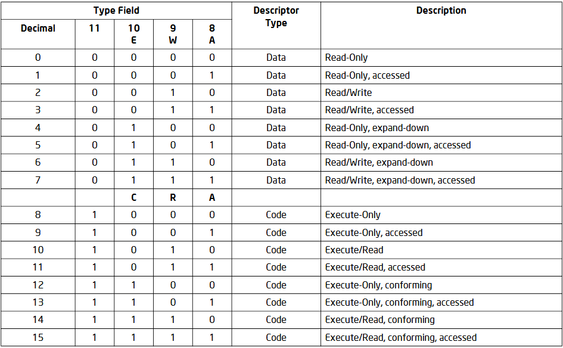

# Modo Real y Modo Protegido

Modos de operación:

* `Modo real`: modo en el que arrancan <u>todos</u> los x86, después de un power-up o reset.
* `Modo protegido`: este modo es el estado nativo del procesador.

## Modo Real:
* Trabaja por defecto en 16 bits
* Podemos direccionar hasta 1MB de memoria[^1].
* Los modos de direccionamiento son más limitados que en modo protegido.
* No hay protección de memoria ni niveles de privilegio.

Las direcciones en modo real(20 bits) se forman con 2 componentes de 16 bits:

* `Dirección Base`: valor de un `registro de segmento`(CS, DS, ES, SS) shifteado 4 bits a la izquierda.
* `Offset`: el valor de un **registro** (AX, BX, CX, DX, SP, BP, SI y DI).


[^1]: En realidad podemos con una [técnica conocida](https://es.scribd.com/document/497997153/Como-Direccionar-Mas-Alla-del-Primer-MegaByte-en-el-Modo-Real-de-las-PC).

#### Figura 1 


> #### Ejemplo:  
> ```
> Segmento : Offset  
>   0x12F3 : 0x4B27
> ```
> ```
> Dirección Física = Segmento x 16 + Offset
>          0x17A57 = 0x12F30 + 0x4B27
> ```

|                          | Modo real | Modo protegido          |
|--------------------------|-----------|-------------------------|
| **Memoria disponible**   | ~1 MB     | 4 GB                    |
| **Privilegios**          | :(        | 4 niveles de protección |
| **Interrupciones**       | Rutinas de atención | Rutinas de atención con privilegios |
| **Set de instrucciones** | Todas | Depende del nivel de privilegio |

## Bootloader

1) CPU ejecuta código residente en memoria flash de BIOS.
2) BIOS ejecuta POST (Power on Self Test) en los dispositivos.
3) BIOS busca un dispositivo "booteable"
4) Se copia a memoria principal en la posición 0x7C00 el sector de booteo(512 bytes)

## Segmentación

#### Figura 2


### Selector de segmento

Un **selector de segmento** es un valor que identifica a un segmento. No apunta directamente a un segmento, sino al [descriptor de segmento](#descriptor-de-segmento) que lo define.

#### Figura 3


* `Indice`: Selecciona uno de los 8192 descriptores en la GDT o LDT. El procesador multiplica este valor por 8 (# de bytes en un descriptor de segmento) y suma el resultado a la dirección base de la GDT o LDT.
* `TI (table indicator) flag`: Especifica qué tabla de descriptores usar.
* `Requested Privilege Level(RPL)`: Especifica el nivel de privilegio del selector, siendo 0 el más privilegiado, y 3 el menos.

`CS`: Para acceder a código.  
`SS`: Para acceder a pila.  
`DS`: Para acceder a datos (default)  
`ES`: Para acceder a datos.  
`GS`: Para acceder a datos.  
`FS`: Para acceder a datos.  

### Descriptor de segmento

Un **descriptor de segmento** es una estructura de datos en la [GDT](#global-descriptor-table-gdt) o LDT que provee al procesador con el tamaño y ubicación de un segmento, así como también control de acceso e información sobre su estado.

#### Figura 4


* `Segment Limit`: Indica el tamaño de un segmento (menos uno! -Furfi), interpretado como **"el máximo offset posible para moverse en ese segmento"**. Para esto, se debe tener en cuenta el bit **G**.
* `Base Address`: Define la ubicación del comienzo del segmento.
* `Type`: ver [Figura 5](#figura-5).
* `S (descriptor type) flag`: Especifica si el descriptor es para un segmento de sistema **(S = 0)** o de datos **(S = 1)**.
* `DPL (descriptor privilege level)`: Indica el nivel de privilegio. Sólo usamos **DPL = 0** para kernel y **DPL = 3** para usuario.
* `P (segment-present)`: Indica si el segmento está presente en memoria **(P = 1)** o no **(P = 0)**.
* `G (granularidad)`: Determina la escala del Segment Limit.

#### Figura 5


## Global Descriptor Table (GDT)