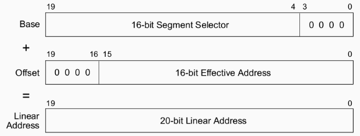

# Modo Real y Modo Protegido

Modos de operación:

* **Modo real**: modo en el que arrancan <u>todos</u> los x86, después de un power-up o reset.
* **Modo protegido**: este modo es el estado nativo del procesador.

## Modo Real:
* Trabaja por defecto en 16 bits
* Podemos direccionar hasta 1MB de memoria[^1].
* Los modos de direccionamiento son más limitados que en modo protegido.
* No hay protección de memoria ni niveles de privilegio.

Las direcciones en modo real(20 bits) se forman con 2 componentes de 16 bits:

* **Dirección Base**: valor de un **registro de segmento**(CS, DS, ES, SS) shifteado 4 bits a la izquierda.
* **Offset**: el valor de un **registro** (AX, BX, CX, DX, SP, BP, SI y DI).


[^1]: En realidad podemos con una [técnica conocida](https://es.scribd.com/document/497997153/Como-Direccionar-Mas-Alla-del-Primer-MegaByte-en-el-Modo-Real-de-las-PC).




> #### Ejemplo:  
> ```
> Segmento : Offset  
>   0x12F3 : 0x4B27
> ```
> ```
> Dirección Física = Segmento x 16 + Offset
>          0x17A57 = 0x12F30 + 0x4B27
> ```

