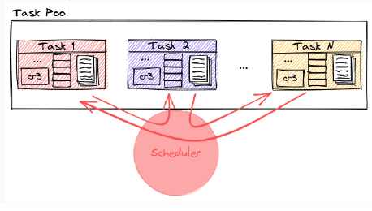
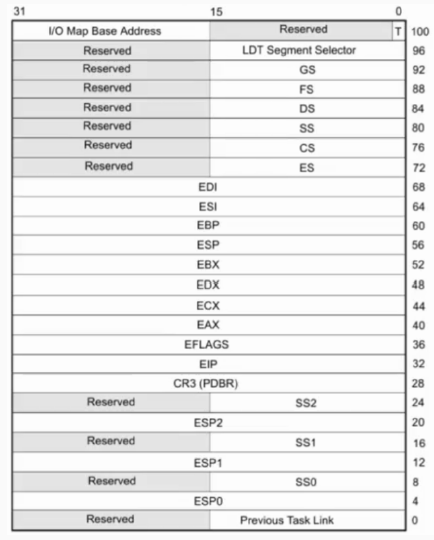

# Tareas
Una **tarea** es una **unidad de trabajo** que el procesador puede **despachar**, **ejecutar** y **suspender**. Puede ser usada para ejecutar un programa. 

Dos o más tareas pueden tener un mismo *código de programa*, sin embargo, su *contexto de ejecución y datos asociados* pueden ser distintos. 

## Índice:
- [Scheduler](#scheduler)
- [Context Switch](#intercambio-de-tareas)
- [Tareas Inicial e Idle](#definición-de-tareas-inicial-e-idle)
- [Rutina de atención de interrupción del reloj](#rutina-de-atención-de-interrupciones-de-reloj)
- [Niveles de privilegio de tareas](#niveles-de-privilegio-de-tareas)

## Espacio de ejecución y segmento de estado
En la memoria, una tarea va a tener:
- Espacio de ejecución: es decir <u>*páginas mapeadas*</u> donde va a tener el <u>*código*</u>, <u>*datos*</u> y <u>*pilas*</u>.
- Segmento de estado (TSS): Una <u>*región de memoria*</u> que almacenen el <u>*estado de una tarea*</u>, a la espera de iniciarse o al momento de ser desalojada por el procesador, y con un formato específico para que podamos iniciarla/reanudarla. La información que se va a guardar en esta región sería:
    - Registros de propósito general
    - Registros de segmento de la tarea y segmento de la pila de nivel 0
    - Flags
    - CR3
    - EIP


> Entonces, una tarea tiene:
> - Espacio de ejecución: código, datos, pila
> - Segmento de estado (TSS): es como una "foto" del estado interno de la tarea. La TSS contiene, entre otros:
>    - EIP: en qué instrucción estaba
>    - Registros de propósito general
>    - CR3 (dirección del pd que estaba usando)
>    - ESP, EBP (cómo estaba su pila)
>    - Segmentos (qué selectores de segmento tenía cargados)
>    - EFLAGS
>    - ESP0, SS0 (pilas que debe usar si se cambia a nivel 0) 

## Scheduler
Es un **modelo de software** que *administra la ejecución* de *tareas/procesos*. Utiliza una política o criterio para decidir cuál es la próxima tarea a ejecutar.



Cada vez que **se pasa de una tarea a otra** ocurre un <u>**cambio de contexto**</u>

## Cambio de contexto
El procesador puede **correr una tarea por vez** y cada tarea tiene su **propio contexto de ejecución**.

Al pasar de una tarea a la otra, tiene que ir cambiando el contexto de manera adecuada. Para ello, deberá:
- Guardar en algún lado el contexto actual de la tarea
- Cargar el contexto de la nueva tarea a ejecutar

El procesador se encarga de ir copiando esa info en cada cambio de contexto. 

## Estructuras involucradas
Para definir una tarea, tenemos que completar estructuras de Intel:

#### Task Register:
*¿Qué es el task register?* El task register almacena el `selector de segmento` de la `tarea en ejecución`. Se usa para `encontrar la TSS de la tarea actual`. 


> El Task register, entonces, guarda un selector (como un índice) que apunta a una entrada de la GDT. Esa entrada será la TSS descriptor, que a su vez apunta a la dirección donde está la TSS de la tarea.

#### TSS:
La TSS <u>*guarda una foto del contexto de ejecución de la tarea*</u>. Al crear la tarea <u>hay que setear los valores iniciales</u>. 



Estos valores iniciales son aquellos que se **van a cargar en los registros de CPU y que usará para la ejecución**. Entre ellos se encuentran:
- `EIP`
- `ESP`, `EBP`, `ESP0` (puntero al tope de la pila de nivel 0)
- Los selectores de segmento `CS`, `DS`, `ES`, `FS`, `GS`, `SS`, `SS0` (selector de la pila de nivel 0)
- El `CR3` que va a tener la <u>paginación asociada a la tarea</u>. 
- `EFLAGS` en 0x00000202 para tener las interrupciones habilitadas.

### TSS Descriptor


***Atributos de la TSS descriptor:***
- `B` (busy): indica si la tarea *está siendo ejecutada*. Lo inicializamos en 0.
- `DPL`: el nivel de privilegio que se precisa para <u>acceder al segmento</u>. Usamos <u>**nivel 0**</u> porque </u>**sólo el kernel puede intercambiar tareas**</u>. 
- `LIMIT`: tamaño máximo de la TSS. 67h es el mínimo requerido. 
- `BASE`: indica la dirección base de la TSS. 

## Definición de tareas Inicial e Idle
El procesador siempre <u>precisa estar ejecutando una tarea</u>. Hay dos situaciones especiales:
- Al arrancar la compu, ¿qué tarea se ejecuta?
- Y si no hubiera ninguna tarea para ejecutar en algún momento ¿qué tarea se ejecuta?

Es entonces donde definimos dos tareas especiales: la **tarea Inicial** y la **tarea Idle** para estas situaciones. Además, definiremos aquellas tareas de usuario y/o de kernel que se precisan para que nuestro sistema brinde servicios o haga lo que queramos. 

Necesitamos *dos pasos* para *dejar listo al kernel* para ejecutar las tareas que queramos:
1. Apenas inicia el kernel, hay que cargar la **tarea inicial**. Para hacerlo, vamos a usar la instrucción `LTR` que toma como parámetro un registro de 16 bits con el selector de la tarea en la GDT. 
    ```asm
    LTR ax ; con ax = selector segmento tarea Inicial
    ```
2. Luego, hay que saltar a la **tarea Idle**. La forma de hacerlo es saltar al selector con un JMP y el valor que pongamos en offset es ignorado (podemos poner 0)
    ```asm
    JMP SELECTOR_TAREA_IDLE:0
    ```
    Esto **va a cambiar el valor del registro TR apuntando a la TSS de la tarea Idle y producir el cambio de contexto**. Saltar a una tarea es algo que lo va a hacer el S.O en el nivel 0. 

## Intercambio de tareas
El *scheduler* utiliza una política o criterio para decidir cuál es la próxima tarea a ejecutar y lo hace en cada <u>tick de reloj</u>


## Context Switch
**Context switch es el cambio de una tarea a otra**. Como el procesador, **sólo ejecuta una tarea a la vez**, para cambiar entre ellas necesita *guardar el contexto de la **tarea que deja de ejecutar*** y *cargar el contexto de la **tarea que va a ejecutar***. 


*Estructuras*:
1. **TR** (Task Register):
Guarda el *selector de segmento* de la *tarea actual*. Ese selector *apunta a una TSS en la GDT*
2. **TSS**: Es la *estructura en memoria* que guarda el *estado de la tarea* (registros, `CR3`, `EIP`, pilas, etc). 
3. **GDT**: Contiene todos los descriptores de segmento, incluidas las TSS. 

Contexto: Estamos ejecutando una **tarea A**, que tiene su TSS en `TSS1` y vamos a cambiar a la **tarea B**, cuya TSS está en `TSS2`. 

**CONTEXT SWITCH**:
1. Se produce una **interrupción de reloj**. 
    - llama a la rutina `_isr32`
    - el scheduler decide cambiar de tarea
2. Guardar el contexto de la tarea actual. 
    - El procesador lee `TR`(que contiene el selector de la tarea actual)
    - Busca en la `GDT` el descriptor de ese selector
    - LLega a la `TSS` de la tarea actual (`TSS1`)
    - El procesador guarda todos los registros actuales dentro de esa TSS. Ahora `TSS1` tendrá una "foto" actualizada de la tarea A. 
3. Cargar la nueva tarea. 
    - El scheduler elige una nueva tarea
    - Le dice al procesador que **salte a su TSS** con una instrucción `jmp 0x30:0`, por ejemplo. Este es un jump far que incluye al selector de segmento (`0x30`) y al offset (`0`)
    - El procesador **va a la GDT**, busca el descriptor con ese selector, y encuentra, en este caso, `TSS2`
    - El procesador **carga la `TSS2`** (o sea copia sus valores a los registros del procesador)
4. Actualiza el `TR`
    - El procesador pone el nuevo selector (`0x30`) en TR. (Ya que la TR debe apuntar siempre a la tarea actual)


## Rutina de atención de interrupciones de reloj
🧭Una rutina de atención de interrupción de reloj (por lo menos la que vemos) se encarga de dos cosas:
1. Atender la interrupción como corresponde (como vimos en [Interrupciones](Interrupciones.md))
2. (Si corresponde) cambiar de tarea (*hacer un context switch*) usando la info del *scheduler*.

Veamos y desglosemos la siguiente:


```asm
; fuera de la interrupción:
offset: dd 0 
selector: dw 0
...

global _isr32
_isr32:
pushad ; (1)

call pic_finish1 ; (2)
call sched_nextTask ; (3)

str cx ; (4)
cmp ax, cx ; (5)
je .fin ; (6)

mov [selector], ax ; (7)
jmp far [offset] ; (8)

.fin:
popad ; (9)
iret ; (10)

```

En la parte `fuera de la interrupción`, en algún lugar, se definen `offset` y `selector`. La estructura definida se puede ver como una **dirección lógica de 48 bits little endian**.

*(1)* `pushad`: 

Guarda todos los *registros de propósito general* (`EAX`, `EBX`, `ECX`, etc) en la pila.

*(2)* `call pic_finish1`:

Informa al **PIC** que la interrupción fue atendida. 

*(3)* `call sched_nextTask`:

Llama al **scheduler**, que determina **cuál es la próxima tarea a ejecutar**. Devuelve en `AX` el **selector de segmento** de la TSS de la próxima tarea (que está en la GDT). (*El selector es una referencia a la entrada de la GDT que contiene la TSS de esa tarea*).

*(4)* `str cx`

`str` = **Store Task Register** → guarda en `cx` el contenido del **Task Register**. Es decir, ahora en `cx` tendríamos el **selector de segmento de la tarea actual en ejecución**. 

Entonces:
- `ax` → selector de la **nueva tarea** (que nos indicó el scheduler).
- `cx` → selector de la **tarea actual**.

*(5)* `cmp ax, cx`:

Compara el *selector actual* (`cx`) con el *próximo* (`ax`). 

*(6)* `je .fin`:

Si son iguales, **no habrá cambio de tarea**. Salta al final, restaura registros y sale con `iret`.

*(7)* `mov [selector], ax`:

Guarda el selector de la nueva tarea en una dirección de memoria predefinida (la que definimos al principio)

Ahora tendremos:

```asm
offset: dd 0 
selector: dw ax
```

*(8)* `jmp far [offset]`:

Hace el salto a la nueva tarea, (far jump a la dirección lógica de 48 bits). Este salto **provoca el cambio de contexto automáticamente**. El procesador **carga toda la info de la TSS** (EIP, CR3, registros, etc) y **transfiere el control a la nueva tarea**. 

*(9)* `popad`: restaura los registros guardados con `pushad`

*(10)* `iret`:

Sale de la interrupción restaurando:
- `EIP`: instrucción siguiente a la interrupción.
- `CS`, `EFLAGS`, y si es necesario, la pila (`ESP`, `SS`). 

>⚠️ Si se hizo `jmp far`, esta parte **no se ejecuta**, porque ya se fue a otra tarea.

## Niveles de privilegio de tareas
*Escenario: tarea ejecutando en nivel 0 y se produce una interrupción de reloj*

El nivel de ejecución <u>no cambia</u> dado que la interrupción de reloj es nivel 0


*Ahora, si ejecutamos una tarea ejecutando en nivel 3 y se produce una interrupción de reloj, el <u>nivel de ejecución cambia</u>. Por lo tanto <u>usa la pila de nivel 0 (ss0) indicada en la TSS para guardar la info de retorno</u>*.


Cuando hay niveles de privilegio distintos, la **ss** y el **esp** del procesador siempre toma la del **nivel de ejecución actual**. 

Ejecutando *una tarea de nivel 3* y se produce una *interrupción de nivel 0*. Si se produce un *cambio de contexto*, la TSS de una tarea de nivel 3 podría quedar con un ss almacenado de nivel 0. Los valores de nivel 3 quedan en la pila y se restaurarán con el iret correspondiente. 

💡¿Cuándo cambia el nivel de privilegio? Un caso común es **cuando una interrupción ocurre mientras una tarea de nivel 3 (usuario) se está ejecutando**. Entonces, el **procesador** pasa a **nivel 0**.

Recién vimos los *dos casos posibles*:
- No hay cambio de nivel de privilegio (es decir, se estaba ejecutando una tarea de nivel 0 y se produjo una interrupción de reloj, que es de nivel 0). Entonces el procesador **usa la pila actual** para guardar las `EFLAGS`, `CS` y `EIP`. Esa info se guarda **directamente sobre la misma pila de nivel 0**. 
- Hay cambio de nivel de privilegio (es decir, estamos ejecutando una tarea de nivel 3 y se produce una interrupción de reloj). Por seguridad, el procesador **cambia la pila**. Cambia a la pila de **nivel 0** (`SS0` y `ESP0`) que está en la TSS. Entonces, cambia `SS` y `ESP` al valor de la pila de nivel 0 (desde la TSS). En esa nueva pila guarda el `SS` y `EIP` antiguos (nivel 3), `EFLAGS`, `CS`, `EIP`. 

| Situación                          | ¿Cambia de pila? | ¿Desde dónde saca la pila?          |
|-----------------------------------|------------------|-------------------------------------|
| Nivel 0 → interrupción nivel 0    | No               | Usa la pila actual                  |
| Nivel 3 → interrupción nivel 0    | Sí               | Usa `SS0` y `ESP0` desde la TSS     |


Esto es importante porque el *kernel no puede confiar en la pila del usuario*. 

# Faltaría acá agregar info piola cuando completemos el trabajo
